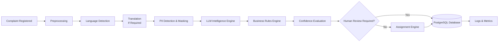
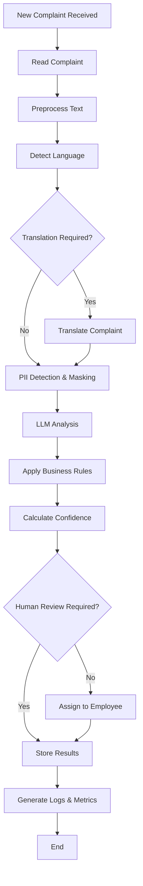

# Enterprise Complaint Intelligence Platform (ECIP)

## System Architecture

### Overview

The Enterprise Complaint Intelligence Platform (ECIP) is a modular, event-driven AI platform designed to automate complaint understanding and decision support for enterprise organizations.

The platform continuously processes newly registered complaints by executing a structured pipeline that combines data preprocessing, AI-driven analysis, configurable business rules, confidence evaluation, intelligent assignment, and persistent audit logging.

Rather than replacing human decision-making, ECIP augments existing complaint management systems by providing explainable AI-generated recommendations while allowing configurable human review for uncertain or high-risk cases.

The architecture is intentionally modular so that individual components—such as AI models, business rules, assignment strategies, or database technologies—can evolve independently without requiring changes to the overall system.

## High-Level Architecture

## Complaint Processing Workflow

The following workflow illustrates the end-to-end lifecycle of a complaint within ECIP.

## Component Responsibilities

| Component               | Responsibility                                                                                                                   |
| ----------------------- | -------------------------------------------------------------------------------------------------------------------------------- |
| Complaint Ingestion     | Receives newly registered complaints from enterprise systems and initiates processing.                                           |
| Preprocessing Service   | Cleans, normalizes, and standardizes complaint text before analysis.                                                             |
| Language Detection      | Identifies the language of the complaint.                                                                                        |
| Translation Service     | Translates non-English complaints into the supported processing language when required.                                          |
| PII Detection & Masking | Detects and masks personally identifiable information before AI processing.                                                      |
| LLM Intelligence Engine | Generates AI-driven insights such as severity, priority, category, sentiment, root cause, suggested resolution, and explanation. |
| Business Rules Engine   | Applies configurable business policies and validation rules to AI predictions.                                                   |
| Confidence Evaluation   | Calculates confidence scores and determines whether automated processing is sufficiently reliable.                               |
| Human Review Decision   | Flags low-confidence or high-risk complaints for manual review.                                                                  |
| Assignment Engine       | Recommends the most suitable employee based on expertise and workload.                                                           |
| Database Layer          | Persists complaints, AI predictions, assignments, and audit information.                                                         |
| Logging & Monitoring    | Records application logs, processing metrics, and operational events for monitoring and troubleshooting.                         |

