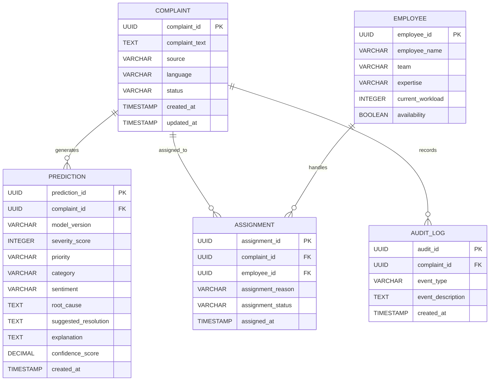

# Enterprise Complaint Intelligence Platform (ECIP)

# Database Design

## Overview

The ECIP database is designed to support the complete lifecycle of complaint processing while maintaining scalability, auditability, and modularity.

The initial version of the platform focuses on five core business entities:

- Complaint
- Prediction
- Employee
- Assignment
- Audit Log

Each entity represents a distinct business responsibility and is designed to minimize duplication while supporting future enhancements.

## Complaint Entity

| Column | Data Type | Description |
|---------|-----------|-------------|
| complaint_id | UUID | Unique identifier for each complaint. |
| complaint_text | TEXT | Original complaint submitted by the customer. |
| source | VARCHAR | Source channel (Email, Portal, Chat, etc.). |
| language | VARCHAR | Original language of the complaint. |
| status | VARCHAR | Current complaint status (New, Processing, Assigned, Closed). |
| created_at | TIMESTAMP | Complaint creation timestamp. |
| updated_at | TIMESTAMP | Last updated timestamp. |

## Prediction Entity

The Prediction entity stores the AI analysis generated for a complaint along with the final business decision after applying organizational rules. Multiple prediction records can exist for a single complaint to support model versioning, reprocessing, and historical comparison.

| Column | Data Type | Description |
|---------|-----------|-------------|
| prediction_id | UUID | Unique identifier for the prediction. |
| complaint_id | UUID (FK) | Reference to the associated complaint. |
| model_version | VARCHAR | AI model version used for prediction. |
| severity_score | INTEGER | AI-generated severity score (0–100). |
| category | VARCHAR | AI-predicted complaint category. |
| sentiment | VARCHAR | AI-predicted sentiment. |
| root_cause | TEXT | AI-generated root cause analysis. |
| suggested_resolution | TEXT | AI-generated resolution recommendation. |
| explanation | TEXT | Explanation supporting the AI prediction. |
| confidence_score | DECIMAL | Confidence score of the AI prediction. |
| final_priority | VARCHAR | Final complaint priority after Business Rules evaluation. |
| created_at | TIMESTAMP | Prediction creation timestamp. |

## Employee Entity

The Employee entity stores information required for intelligent complaint assignment. It is intentionally lightweight and contains only the attributes necessary for routing complaints.

| Column | Data Type | Description |
|---------|-----------|-------------|
| employee_id | UUID | Unique identifier for the employee. |
| employee_name | VARCHAR | Employee name. |
| team | VARCHAR | Team or department. |
| expertise | VARCHAR | Area of expertise (Payments, Cards, Loans, Fraud, etc.). |
| current_workload | INTEGER | Number of active complaints assigned. |
| availability | BOOLEAN | Indicates whether the employee is available for assignment. |
| created_at | TIMESTAMP | Record creation timestamp. |

## Assignment Entity

The Assignment entity records which employee is responsible for handling a complaint. It also maintains assignment history for auditing and future analysis.

| Column | Data Type | Description |
|---------|-----------|-------------|
| assignment_id | UUID | Unique identifier for the assignment. |
| complaint_id | UUID (FK) | Associated complaint. |
| employee_id | UUID (FK) | Assigned employee. |
| assignment_reason | VARCHAR | Reason for assignment (AI, Manual, Escalation). |
| assigned_at | TIMESTAMP | Assignment timestamp. |
| assignment_status | VARCHAR | Current assignment status. |

## Audit Log Entity

The Audit Log entity records important system events throughout the complaint lifecycle. It provides traceability, supports debugging, and enables compliance with enterprise audit requirements.

| Column | Data Type | Description |
|---------|-----------|-------------|
| audit_id | UUID | Unique audit record identifier. |
| complaint_id | UUID (FK) | Associated complaint. |
| event_type | VARCHAR | Type of event (Created, Predicted, Assigned, Reviewed, Closed). |
| event_description | TEXT | Description of the event. |
| created_at | TIMESTAMP | Event timestamp. |

## Entity Relationship Diagram

## Database Design Decisions

The following design principles were adopted while designing the ECIP database:

- Business entities are separated based on responsibility.
- Original complaint data is stored independently from AI-generated predictions.
- AI predictions are versioned to support future model upgrades and reprocessing.
- Assignment history is preserved instead of overwriting ownership information.
- Audit logs capture all major system events to improve traceability and debugging.
- UUIDs are used as primary keys to support globally unique identifiers.
- Business Rules determine the final complaint priority after AI analysis, ensuring organizational policies are consistently applied.

## Entity Relationships

| Relationship | Cardinality | Reason |
|--------------|-------------|--------|
| Complaint → Prediction | One-to-Many | A complaint may be reprocessed multiple times using different AI models or prompts. |
| Complaint → Assignment | One-to-Many | Complaints may be reassigned or escalated. |
| Employee → Assignment | One-to-Many | One employee can handle multiple complaints. |
| Complaint → Audit Log | One-to-Many | Every important event is recorded for traceability. |

## Database Constraints

The following constraints will be enforced:

- Every Prediction must belong to an existing Complaint.
- Every Assignment must reference an existing Complaint and Employee.
- Every Audit Log entry must reference an existing Complaint.
- Primary keys are immutable.
- Foreign key integrity must always be maintained.

## Recommended Indexes

The following columns should be indexed to improve query performance:

- complaint_id
- employee_id
- assignment_status
- final_priority
- created_at

